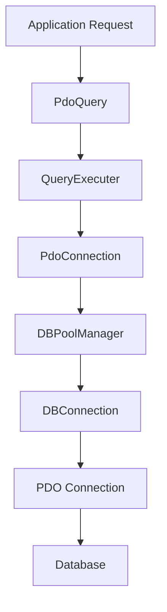
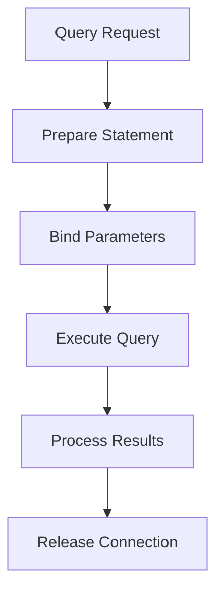
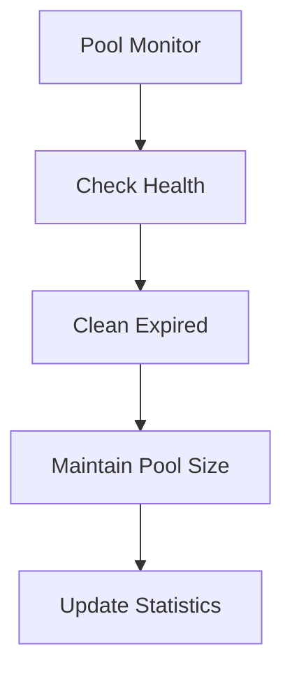

# Database Connection Architecture

## Overview
The database connection system implements a robust, layered architecture for managing database connections and queries. It provides connection pooling, efficient resource management, and a high-level query interface.

## System Components

### 1. Application Layer
#### PdoQuery
- High-level query interface
- Extends QueryExecuter
- Provides common database operations
```php
class PdoQuery extends QueryExecuter {
    public function insertQuery()
    public function updateQuery()
    public function deleteQuery()
    public function selectQuery()
    public function selectQueryObjects()
    public function selectCountQuery()
}
```

### 2. Query Execution Layer
#### QueryExecuter
- Handles query preparation and execution
- Manages connection state
- Provides error handling
```php
class QueryExecuter {
    private ?PdoConnection $pdoManager;
    private ?PDO $db;
    private bool $isConnected;
}
```

### 3. Connection Management Layer
#### PdoConnection
- Manages connection lifecycle
- Implements connection pooling
- Provides connection validation
```php
class PdoConnection {
    private static array $connectionPool;
    private static int $totalConnections;
    private string $poolKey;
    private string $instanceId;
}
```

#### DBPoolManager
- Manages connection pool
- Handles connection reuse
- Controls connection lifecycle
```php
class DBPoolManager {
    private static array $availableConnections;
    private static array $inuseConnections;
}
```

#### DBConnection
- Base connection class
- Handles individual PDO connections
- Manages connection state
```php
class DBConnection {
    private bool $isConnected;
    private ?string $error;
    private ?PDO $db;
    private string $instanceId;
}
```

## System Flow

### 1. Connection Flow


### 2. Query Execution Flow


### 3. Connection Pool Management


## Key Features

### 1. Connection Pooling
- Efficient connection reuse
- Automatic connection cleanup
- Connection health checks
- Resource optimization

### 2. Error Handling
- Detailed error messages
- Stack trace logging
- Operation context in errors
- Consistent error handling

### 3. Query Interface
- Clean API
- Type safety
- Parameter binding
- Transaction support

## Configuration

### Environment Variables
```env
DB_HOST=your_host
DB_PORT=your_port
DB_NAME=your_database
DB_USER=your_username
DB_PASSWORD=your_password
DB_CONNECTION_MAX_AGE=300
MIN_DB_CONNECTION_POOL=5
MAX_DB_CONNECTION_POOL=10
DB_QUERY_TIMEOUT=30
APP_ENV=dev  # or 'prod'
```

## Usage Examples

### 1. Basic Query Execution
```php
$pdoQuery = new PdoQuery();

// Insert
$userId = $pdoQuery->insertQuery(
    "INSERT INTO users (name, email) VALUES (:name, :email)",
    [':name' => 'John', ':email' => 'john@example.com']
);

// Select
$user = $pdoQuery->selectQuery(
    "SELECT * FROM users WHERE id = :id",
    [':id' => $userId]
);
```

### 2. Transaction Handling
```php
try {
    $pdoQuery->beginTransaction();
    
    // Perform operations
    $pdoQuery->insertQuery(...);
    $pdoQuery->updateQuery(...);
    
    $pdoQuery->commit();
} catch (Exception $e) {
    $pdoQuery->rollback();
    throw $e;
}
```

## Best Practices

1. **Connection Management**
   - Always release connections after use
   - Use try-finally blocks
   - Monitor pool size
   - Handle connection errors

2. **Query Execution**
   - Use prepared statements
   - Bind parameters properly
   - Handle transactions correctly
   - Check query results

3. **Error Handling**
   - Catch and log errors
   - Clean up resources
   - Provide meaningful error messages
   - Handle connection failures

4. **Performance**
   - Monitor connection pool size
   - Clean expired connections
   - Use appropriate timeouts
   - Optimize query patterns

## System Limitations

1. **Connection Management**
   - Static state in pool manager
   - Potential thread safety issues
   - Memory management concerns

2. **Configuration**
   - Direct environment variable dependency
   - Limited configuration validation
   - No default configuration handling

## Future Improvements

1. **Architecture**
   - Simplify connection management
   - Implement dependency injection
   - Add configuration management
   - Improve testing support

2. **Features**
   - Add connection retry logic
   - Implement query logging
   - Add performance monitoring
   - Enhance error handling

3. **Security**
   - Add connection encryption
   - Implement access control
   - Add query validation
   - Enhance error reporting
