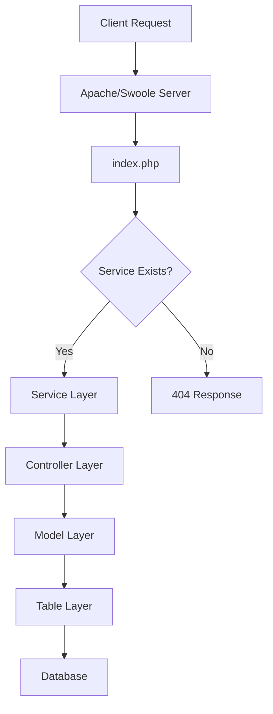
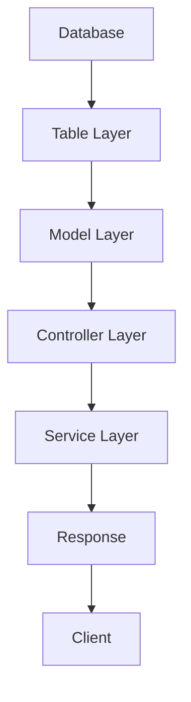

# Architecture Overview

## Core Components

GEMVC follows a layered architecture pattern with clear separation of concerns:

### 1. Service Layer (`/app/api`)
- Entry point for all API requests
- Handles request validation
- Manages authentication
- Routes to appropriate controllers

### 2. Controller Layer (`/app/controller`)
- Processes business logic
- Manages data flow
- Returns appropriate responses
- Handles error cases

### 3. Model Layer (`/app/model`)
- Extends from Table
- Adds business logic
- Processes data
- Handles relationships

### 4. Table Layer (`/app/table`)
- Database abstraction
- Type-safe properties
- Fluent query interface
- Data persistence

## Component Hierarchy

```
Service (ApiService)
    ↑
    │ uses
    │
Controller (Controller)
    ↑
    │ uses
    │
Model (Model)
    ↑
    │ extends
    │
Table (Table)
    ↑
    │ extends
    │
PdoQuery
    ↑
    │ extends
    │
QueryExecuter
    ↑
    │ uses
    │
PdoConnection
```

## Core Classes

### 1. Bootstrap (`src/core/Bootstrap.php`)
- Routes HTTP requests
- Handles API and web requests
- Manages error responses
- Integrates with service layer

### 2. ApiService (`src/core/ApiService.php`)
- Defines API endpoint structure
- Implements request validation
- Handles response formatting
- Provides authentication methods

### 3. Controller (`src/core/Controller.php`)
- Handles request processing
- Manages model interactions
- Implements security features
- Provides response formatting

### 4. Model (`src/core/Model.php`)
- Base class for all models
- Provides common functionality
- Handles data processing
- Manages relationships

### 5. Table (`src/database/Table.php`)
- Database abstraction layer
- Type-safe properties
- Fluent query interface
- Data persistence

## Request Flow



## Response Flow



## Security Architecture

### 1. Authentication
- JWT-based authentication
- Role-based authorization
- Token validation
- Secure session management

### 2. Input Validation
- Type-safe validation
- Schema-based validation
- Automatic sanitization
- XSS protection

### 3. Database Security
- Prepared statements
- Parameter binding
- SQL injection prevention
- Type-safe queries

## Performance Architecture

### 1. Connection Pooling
- Efficient database connections
- Connection reuse
- Health verification
- Resource tracking

### 2. Caching
- Query caching
- Result caching
- Cache invalidation
- Memory optimization

### 3. Async Processing
- Non-blocking I/O
- Coroutine support
- Event-driven architecture
- Resource optimization

## Next Steps

- [Request Lifecycle](request-lifecycle.md)
- [Security Guide](../guides/security.md)
- [Performance Guide](../guides/performance.md) 