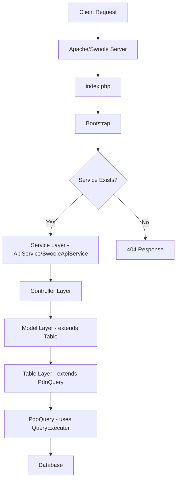
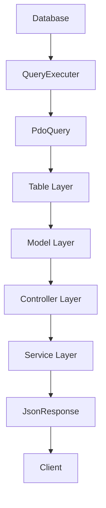

# Architecture Overview

## Core Components

GEMVC follows a layered architecture pattern with clear separation of concerns:

### 1. Service Layer (`/app/api`)
- Entry point for all API requests
- Handles request validation
- Manages authentication
- Routes to appropriate controllers

### 2. Controller Layer (`/app/controller`)
- Processes business logic
- Manages data flow
- Returns appropriate responses
- Handles error cases

### 3. Model Layer (`/app/model`)
- Extends from Table
- Adds business logic
- Processes data
- Handles relationships

### 4. Table Layer (`/app/table`)
- Database abstraction
- Type-safe properties
- Fluent query interface
- Data persistence

## Component Hierarchy

```
Service (ApiService/SwooleApiService)
    ↑
    │ uses
    │
Controller (Controller)
    ↑
    │ uses
    │
Model (extends Table)
    ↑
    │ extends
    │
Table (extends PdoQuery)
    ↑
    │ composition
    │
PdoQuery (uses QueryExecuter)
    ↑
    │ uses
    │
QueryExecuter (uses DatabasePoolFactory)
    ↑
    │ uses
    │
DatabasePoolFactory (creates Connection Pools)
```

## Core Classes

### 1. Bootstrap (`src/core/Bootstrap.php`)
- Routes HTTP requests
- Handles API and web requests
- Manages error responses
- Integrates with service layer
- Determines service/method from URL segments
- Supports both Apache and OpenSwoole environments

### 2. ApiService (`src/core/ApiService.php`)
- Defines API endpoint structure
- Implements request validation (`validatePosts`, `validateStringPosts`)
- Handles response formatting
- Provides authentication methods
- Uses `die()` for error handling (Apache-compatible)

### 3. SwooleApiService (`src/core/SwooleApiService.php`)
- OpenSwoole-compatible API service base class
- Returns responses instead of using `die()`
- Same validation methods as ApiService
- Safe for persistent process model

### 4. Controller (`src/core/Controller.php`)
- Handles request processing
- Manages model interactions
- Implements security features
- Provides response formatting
- Includes pagination, sorting, and filtering capabilities

### 5. Table (`src/database/Table.php`)
- Database abstraction layer with lazy loading
- Type-safe properties with `_type_map`
- Fluent query interface
- Data persistence with CRUD operations
- Automatic property exclusion (underscore-prefixed properties)

### 6. PdoQuery (`src/database/PdoQuery.php`)
- High-level database operations
- Uses QueryExecuter via composition
- Lazy connection initialization
- Automatic resource management

## Request Flow



## Response Flow



## Security Architecture

### 1. Authentication
- JWT-based authentication via `JWTToken` class
- Role-based authorization with `Request::auth()`
- Token validation and verification
- Secure session management

### 2. Input Validation
- Type-safe validation with `validatePosts()`
- String length validation with `validateStringPosts()`
- Automatic sanitization
- XSS protection

### 3. Database Security
- Prepared statements via QueryExecuter
- Parameter binding
- SQL injection prevention
- Type-safe queries with property mapping

## Performance Architecture

### 1. Connection Pooling
- Efficient database connections via DatabasePoolFactory
- Connection reuse with health verification
- Resource tracking and management
- Environment-specific pools (OpenSwoole vs Standard)

### 2. Lazy Loading
- Database connections created only when needed
- PdoQuery instantiated on first use
- Error storage before connection creation
- Memory optimization

### 3. Caching
- Redis integration via RedisManager
- Query result caching
- Response caching with TTL
- Cache invalidation

### 4. Async Processing (OpenSwoole)
- Non-blocking I/O
- Coroutine support
- Event-driven architecture
- Resource optimization

## File Structure

```
src/
├── core/                    # Core framework components
│   ├── ApiService.php      # Base API service (Apache)
│   ├── SwooleApiService.php # Base API service (OpenSwoole)
│   ├── Bootstrap.php       # Request routing
│   ├── Controller.php      # Base controller
│   └── RedisManager.php    # Redis connection management
├── http/                   # HTTP handling components
│   ├── Request.php         # Request processing
│   ├── JsonResponse.php    # Response formatting
│   ├── JWTToken.php        # JWT authentication
│   └── SwooleRequest.php   # OpenSwoole request handling
├── database/               # Database components
│   ├── Table.php           # Base table class
│   ├── PdoQuery.php        # Query interface
│   ├── QueryExecuter.php   # Low-level database operations
│   └── DatabasePoolFactory.php # Connection pooling
├── CLI/                    # Command-line tools
│   └── commands/           # CLI commands
├── helper/                 # Utility classes
└── traits/                 # Reusable traits
```

## Environment Support

### Apache Environment
- Uses `ApiService` base class
- Traditional request/response cycle
- `die()` for error handling
- Standard PHP session management

### OpenSwoole Environment
- Uses `SwooleApiService` base class
- Persistent process model
- Response return instead of `die()`
- Coroutine-safe operations

## Next Steps

- [Request Lifecycle](request-lifecycle.md)
- [Security Guide](../guides/security.md)
- [Performance Guide](../guides/performance.md) 