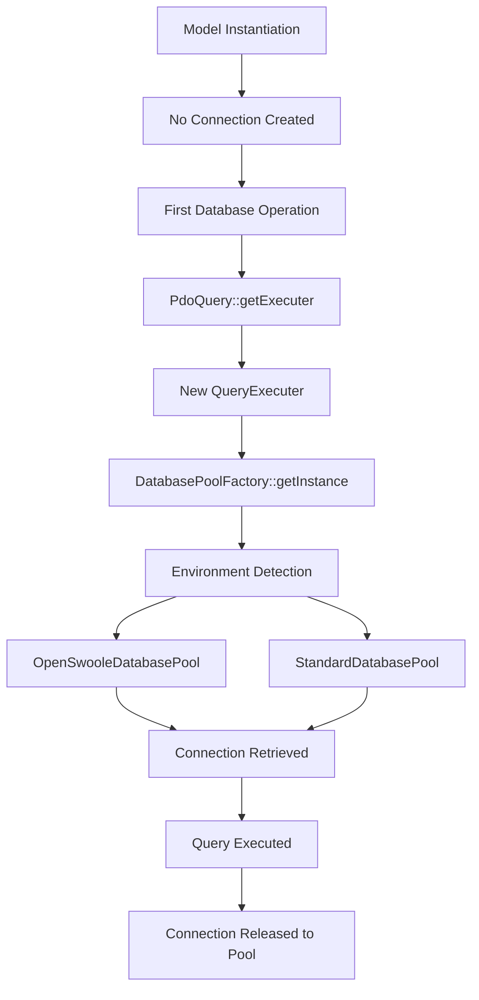
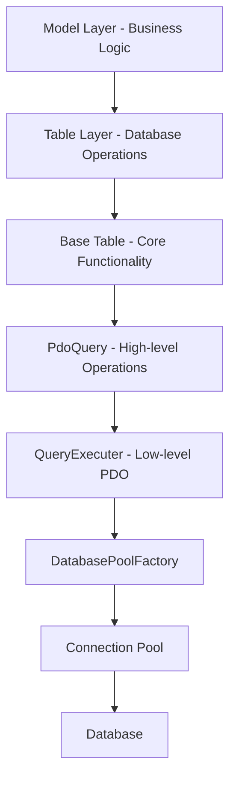
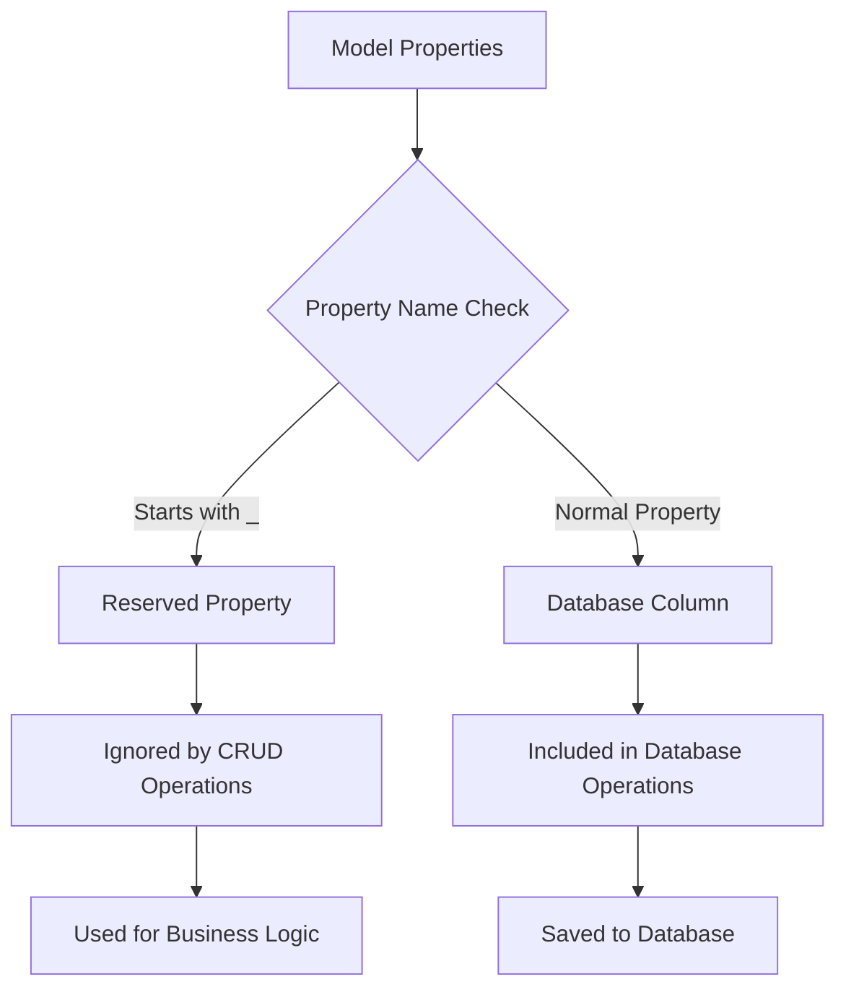

# Database Architecture

## Directory Structure
```
src/database/
├── AbstractDatabasePool.php    # Base abstract class for pool management
├── OpenSwooleDatabasePool.php  # OpenSwoole-specific pool implementation
├── StandardDatabasePool.php    # Standard pool implementation
├── DatabasePoolFactory.php     # Factory for creating pool instances
├── QueryExecuter.php          # Low-level PDO operations and connection management
├── PdoQuery.php               # High-level query interface (uses QueryExecuter via composition)
├── Table.php                  # Base table abstraction with lazy loading
├── query/                     # Query building components
│   ├── Select.php             # SELECT query builder
│   ├── Insert.php             # INSERT query builder
│   ├── Update.php             # UPDATE query builder
│   ├── Delete.php             # DELETE query builder
│   ├── WhereTrait.php         # WHERE clause functionality
│   └── LimitTrait.php         # LIMIT clause functionality
├── QueryBuilder.php           # Query builder implementation
├── QueryBuilderInterface.php  # Query builder contract
├── TableGenerator.php         # Table generation utilities
└── SqlEnumCondition.php      # SQL condition enums

app/
├── table/                     # Table layer - single database table representations
│   ├── UserTable.php          # Users table with database properties
│   ├── ProfileTable.php       # Profiles table
│   └── OrderTable.php         # Orders table
└── model/                     # Model layer - business logic + multi-table operations
    ├── User.php               # User business logic (extends UserTable)
    ├── Order.php              # Order business logic
    └── Product.php            # Product business logic
```

## Database Architecture Layers

The database system follows a clean two-layer architecture with lazy loading throughout:

```
Model Layer (Business Logic + Multi-Table Operations)
    ↓ (extends)
Table Layer (Single Database Table + Properties)
    ↓ (extends)
Base Table (Core Database Functionality)
    ↓ (composition with lazy loading)
PdoQuery → QueryExecuter → DatabasePoolFactory → Connection Pools
```

### Database Layer Responsibilities

1. **Model Layer**: Business logic, validation, multi-table operations, relationships
2. **Table Layer**: Single database table representation, table-specific operations

## Core Components

### 1. Connection Pool Management (with Lazy Loading)

#### DatabasePoolFactory
- Singleton factory for pool creation
- Environment detection (OpenSwoole vs Standard PHP)
- Lazy initialization - pools created only when needed
```php
class DatabasePoolFactory {
    private static ?AbstractDatabasePool $instance = null;
    
    public static function getInstance(): AbstractDatabasePool {
        if (self::$instance === null) {
            if (extension_loaded('openswoole')) {
                self::$instance = new OpenSwooleDatabasePool();
            } else {
                self::$instance = new StandardDatabasePool();
            }
        }
        return self::$instance;
    }
}
```

#### AbstractDatabasePool
- Base abstract class for pool management
- Connection lifecycle and health management
- Performance metrics and monitoring
```php
abstract class AbstractDatabasePool {
    protected array $activeConnections = [];
    protected array $connectionStats = [];
    protected string $error;
    protected int $maxPoolSize;
    protected int $maxConnectionAge;
    
    abstract public function getConnection(): PDO;
    abstract public function releaseConnection(PDO $connection): void;
    abstract public function validateConnection(PDO $connection): bool;
}
```

#### OpenSwooleDatabasePool & StandardDatabasePool
- Environment-specific implementations
- Coroutine-safe operations (OpenSwoole) vs traditional array-based (Standard)
- Automatic connection management and cleanup

### 2. Query Execution (Composition Architecture)

#### QueryExecuter
- Low-level PDO operations and connection management
- Transaction handling and resource cleanup
- Performance metrics and error handling
```php
class QueryExecuter {
    private ?string $error = null;
    private int $affectedRows = 0;
    private string|false $lastInsertedId = false;
    private ?PDOStatement $statement = null;
    private ?PDO $db = null;
    private bool $inTransaction = false;
    private AbstractDatabasePool $pool;
    
    public function __construct() {
        $this->pool = DatabasePoolFactory::getInstance(); // Lazy pool creation
    }
}
```

#### PdoQuery (Composition with Lazy Loading)
- **Uses QueryExecuter via composition (NOT inheritance)**
- High-level database operations with lazy connection initialization
- Automatic resource management and cleanup
```php
class PdoQuery {
    private ?QueryExecuter $executer = null;  // Lazy-loaded
    private bool $isConnected = false;
    
    private function getExecuter(): QueryExecuter {
        if ($this->executer === null) {
            $this->executer = new QueryExecuter(); // Connection created only here
            $this->isConnected = true;
        }
        return $this->executer;
    }
    
    public function insertQuery(string $query, array $bindings): int|false
    public function updateQuery(string $query, array $bindings): ?int
    public function deleteQuery(string $query, array $bindings): int|null|false
    public function selectQuery(string $query, array $bindings): array|false
}
```

### 3. Table Layer (Database Schema Representation)

#### Base Table
- Core database functionality with lazy loading
- Query building, CRUD operations, pagination
- Automatic exclusion of underscore-prefixed properties from database operations
```php
class Table extends PdoQuery {
    protected array $_type_map = [];  // Property type mapping
    
    // Methods automatically ignore properties starting with _
    private function getInsertBindings(): array {
        $arrayBind = [];
        foreach ($this as $key => $value) {
            if ($key[0] === '_') continue; // Skip underscore properties
            $arrayBind[':' . $key] = $value;
        }
        return $arrayBind;
    }
}
```

#### Table Classes (app/table/)
- Represent single database tables
- Define database column properties
- Table-specific query methods
```php
class UserTable extends Table {
    // Database columns only
    public ?int $id = null;
    public ?string $name = null;
    public ?string $email = null;
    public ?bool $is_active = null;
    
    protected array $_type_map = [
        'id' => 'int',
        'is_active' => 'bool'
    ];
    
    public function getTable(): string {
        return 'users';
    }
}
```

### 4. Model Layer (Business Logic)

#### Model Classes (app/model/)
- Extend table classes for database access
- **Use underscore-prefixed properties for non-database data**
- Multi-table operations and business logic
```php
class User extends UserTable {
    // Database columns inherited from UserTable
    
    // Reserved properties (ignored by database operations)
    public ?Profile $_profile = null;
    public array $_orders = [];
    public array $_validation_errors = [];
    public bool $_is_loaded = false;
    
    public function loadComplete(): self {
        // Load related data into _ properties
        if (!$this->_is_loaded && $this->id) {
            // Connection created only when needed
            $this->_profile = Profile::findByUserId($this->id);
            $this->_orders = Order::findByUserId($this->id);
            $this->_is_loaded = true;
        }
        return $this;
    }
}
```

## Lazy Loading Benefits

### 1. Resource Efficiency
```php
// Creating models - NO database connections
$user = new User();              // No connection
$product = new Product();        // No connection
$order = new Order();           // No connection

// Connection created only when database is accessed
$result = $user->findByEmail('john@example.com'); // Connection created here
```

### 2. Memory Optimization
```php
// Can create many model instances without database overhead
$models = [];
for ($i = 0; $i < 1000; $i++) {
    $models[] = new User(); // No connections created
}

// Connections created only when actually used
foreach ($models as $model) {
    if ($someCondition) {
        $model->save(); // Connection created only here
    }
}
```

### 3. Conditional Database Access
```php
public function processUser(array $userData): array {
    $user = User::createFromArray($userData); // No connection
    
    // Business validation without database
    if (!$user->validate()) {
        return ['errors' => $user->_validation_errors]; // No connection ever made
    }
    
    // Database access only when needed
    return $user->save() ? ['success' => true] : ['success' => false];
}
```

## System Flow

### 1. Lazy Connection Flow


### 2. Database Layer Flow


### 3. Underscore Property Handling


## Configuration

### Environment Variables
```env
# Database Configuration
DB_HOST_CLI_DEV="localhost"
DB_HOST="db"
DB_PORT=3306
DB_NAME=your_database
DB_USER=your_username
DB_PASSWORD=your_password
DB_CHARSET=utf8mb4

# Connection Pool Settings
MIN_DB_CONNECTION_POOL=2
MAX_DB_CONNECTION_POOL=10
DB_CONNECTION_MAX_AGE=3600
DB_CONNECTION_TIME_OUT=20
DB_CONNECTION_EXPIER_TIME=20
DB_QUERY_TIMEOUT=30

# Query Settings
QUERY_LIMIT=10

# Environment
APP_ENV=dev  # or 'prod'
```

## Usage Examples

### 1. Table Operations with Lazy Loading
```php
class UserTable extends Table {
    public ?int $id = null;
    public ?string $name = null;
    public ?string $email = null;
    public ?bool $is_active = null;
    
    public function getTable(): string { return 'users'; }
}

$userTable = new UserTable(); // No connection created

// Connection created only when query runs
$users = $userTable->select()
    ->where('is_active', true)
    ->orderBy('created_at', false)
    ->run(); // Connection created here
```

### 2. Model with Reserved Properties
```php
class User extends UserTable {
    // Database columns inherited from UserTable
    
    // Reserved properties (ignored by database operations)
    public ?Profile $_profile = null;
    public array $_recent_orders = [];
    public array $_validation_errors = [];
    
    public function save(): bool {
        if (!$this->validate()) return false;
        
        // Only database columns are saved, _ properties ignored
        return $this->id ? 
            $this->updateSingleQuery() !== null : 
            $this->insertSingleQuery() !== null;
    }
    
    public function validate(): bool {
        $this->_validation_errors = [];
        if (empty($this->name)) {
            $this->_validation_errors[] = 'Name required';
        }
        return empty($this->_validation_errors);
    }
}
```

### 3. Multi-Table Business Logic
```php
class User extends UserTable {
    public ?Profile $_profile = null;
    public array $_orders = [];
    
    public function createWithProfile(array $userData, array $profileData): bool {
        // Set user data
        $this->name = $userData['name'];
        $this->email = $userData['email'];
        
        // Save user - connection created
        if (!$this->save()) return false;
        
        // Create profile using same or new connection
        $profile = new Profile();
        $profile->user_id = $this->id;
        $profile->first_name = $profileData['first_name'];
        
        if ($profile->save()) {
            $this->_profile = $profile; // Store in reserved property
            return true;
        }
        
        return false;
    }
}
```

### 4. Complex Query Building
```php
class UserRepository {
    public function findActiveUsersWithFilters(array $filters): array {
        $userTable = new UserTable(); // No connection
        
        // Build query without connection
        $query = $userTable->select()
                           ->where('is_active', 1)
                           ->whereNull('deleted_at');
        
        // Add filters conditionally
        if (isset($filters['name'])) {
            $query->whereLike('name', $filters['name']);
        }
        
        if (isset($filters['created_after'])) {
            $query->where('created_at', '>=', $filters['created_after']);
        }
        
        // Connection created only when run() is called
        return $query->run();
    }
}
```

## Best Practices

### 1. Lazy Loading
- Instantiate models without concern for database overhead
- Let the system create connections only when needed
- Use reserved properties for computed/related data

### 2. Reserved Properties Convention
- Use underscore prefix for non-database properties
- Store validation errors, computed values, related objects
- Leverage automatic exclusion from CRUD operations

### 3. Database Layer Separation
- **Model Layer**: Implement business logic, validation, multi-table operations
- **Table Layer**: Define database schema, single-table operations

### 4. Connection Management
- Trust the lazy loading system
- Use connection pooling automatically
- Let the system handle resource cleanup

### 5. Error Handling
- Use reserved properties for validation errors
- Implement proper error propagation through database layers
- Log errors appropriately

## Architecture Benefits

### 1. Performance
- **Lazy Loading**: Connections created only when needed
- **Connection Pooling**: Efficient resource reuse
- **Memory Efficiency**: Lightweight model instantiation

### 2. Maintainability
- **Clear Separation**: Each layer has distinct responsibilities
- **Composition over Inheritance**: Flexible and testable design
- **Convention-based**: Underscore prefix for reserved properties

### 3. Scalability
- **Environment Adaptation**: OpenSwoole vs Standard PHP detection
- **Resource Management**: Automatic connection lifecycle
- **Multi-table Support**: Models can orchestrate multiple tables

### 4. Developer Experience
- **Intuitive API**: Natural property-based data access
- **Automatic Exclusion**: No need to manually exclude properties
- **Flexible Models**: Mix database and business properties seamlessly

## Future Improvements

1. **Enhanced Lazy Loading**
   - Lazy loading of related objects
   - Configurable loading strategies
   - Performance monitoring

2. **Advanced Validation**
   - Rule-based validation system
   - Cross-field validation
   - Custom validation rules

3. **Relationship Management**
   - Automatic relationship loading
   - Cascade operations
   - Relationship caching

4. **Performance Optimization**
   - Query result caching
   - Connection pool tuning
   - Query performance monitoring
