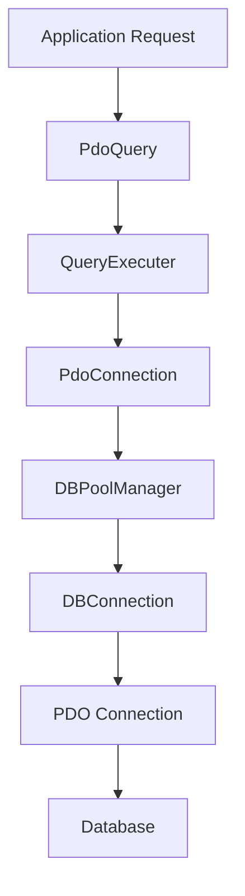
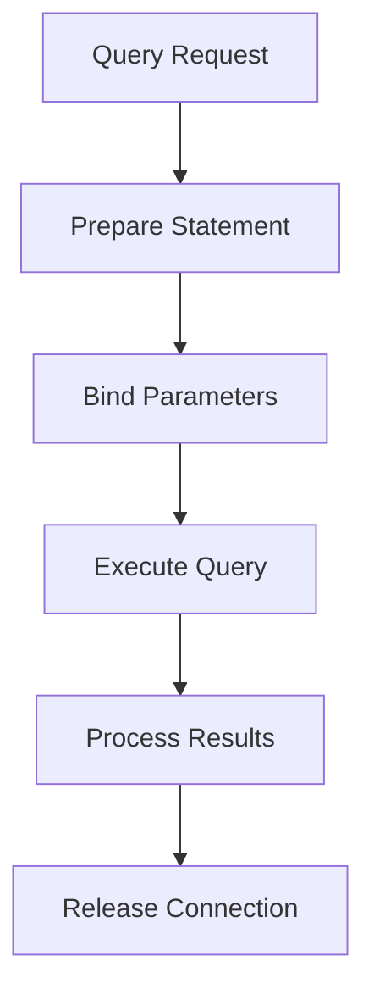
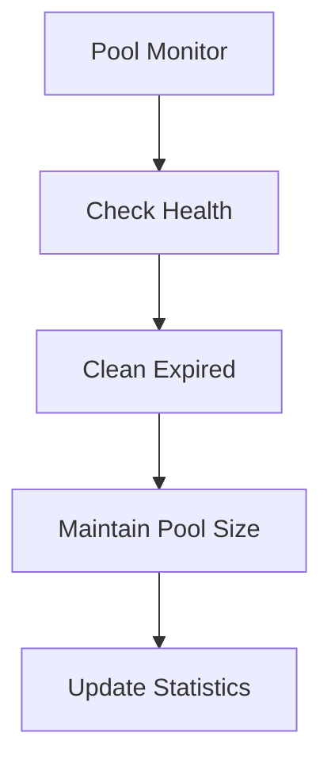

# Database Connection Architecture

## Overview
The database connection system implements a robust, layered architecture for managing database connections and queries. It provides connection pooling, efficient resource management, and a high-level query interface.

## Core Components

### 1. Application Layer
#### PdoQuery
- High-level query interface
- Extends QueryExecuter
- Provides common database operations
```php
class PdoQuery extends QueryExecuter {
    public function insertQuery()
    public function updateQuery()
    public function deleteQuery()
    public function selectQuery()
    public function selectQueryObjects()
    public function selectCountQuery()
}
```

### 2. Query Execution Layer
#### QueryExecuter
- Handles query preparation and execution
- Manages connection state
- Provides error handling
```php
class QueryExecuter {
    private ?PdoConnection $pdoManager;
    private ?PDO $db;
    private bool $isConnected;
}
```

### 3. Connection Management Layer
#### PdoConnection
- Manages connection lifecycle
- Implements connection pooling
- Provides connection validation
```php
class PdoConnection {
    private static array $connectionPool;
    private static int $totalConnections;
    private string $poolKey;
    private string $instanceId;
}
```

#### DBPoolManager
- Manages connection pool
- Handles connection reuse
- Controls connection lifecycle
```php
class DBPoolManager {
    private static array $availableConnections;
    private static array $inuseConnections;
}
```

#### DBConnection
- Base connection class
- Handles individual PDO connections
- Manages connection state
```php
class DBConnection {
    private bool $isConnected;
    private ?string $error;
    private ?PDO $db;
    private string $instanceId;
}
```

## Type System

### Property Types
```php
class UserTable extends Table
{
    public int $id;
    public string $username;
    public string $email;
    public bool $is_active = true;
    public ?string $bio = null;
    public array $permissions = [];
    
    protected array $_type_map = [
        'id' => 'int',
        'is_active' => 'bool',
        'permissions' => 'json'
    ];
}
```

### Type Mapping
- `int`: Integer values
- `string`: String values
- `bool`: Boolean values
- `float`: Floating-point values
- `array`: Array values (stored as JSON)
- `json`: JSON values
- `datetime`: DateTime values
- `date`: Date values
- `time`: Time values

## System Flow

### 1. Connection Flow


### 2. Query Execution Flow


### 3. Connection Pool Management


## Query Building

### Select Queries
```php
$users = $table->select()
    ->where('is_active', true)
    ->where('age', '>', 18)
    ->whereIn('role', ['admin', 'user'])
    ->orderBy('created_at', 'DESC')
    ->limit(10)
    ->offset(0)
    ->run();
```

### Insert Queries
```php
$userId = $table->insert([
    'username' => 'john_doe',
    'email' => 'john@example.com',
    'is_active' => true
])->run();
```

### Update Queries
```php
$table->update([
    'is_active' => false
])
->where('id', 1)
->run();
```

### Delete Queries
```php
$table->delete()
    ->where('id', 1)
    ->run();
```

## Configuration

### Environment Variables
```env
# Database Configuration
# because cli run on local machine on Dockerise application it is differ by host name inside docker network
DB_HOST_CLI_DEV="localhost"
# db host name is defined in docker-compose.yml which actually run in app for crud operation
DB_HOST="db"
DB_PORT=your_port
DB_NAME=your_database
DB_USER=your_username
DB_PASSWORD=your_password
DB_CHARSET=utf8mb4

# Connection Pool Settings
MIN_DB_CONNECTION_POOL=2
MAX_DB_CONNECTION_POOL=10
DB_CONNECTION_MAX_AGE=3600
DB_CONNECTION_TIME_OUT=20
DB_CONNECTION_EXPIER_TIME=20
DB_QUERY_TIMEOUT=30

# Query Cache Settings
DB_CACHE_ENABLED=true
DB_CACHE_TTL_SEC=3600
DB_CACHE_MAX_QUERY_SIZE=1000

APP_ENV=dev  # or 'prod'
```

## Usage Examples

### 1. Basic Query Execution
```php
$pdoQuery = new PdoQuery();

// Insert
$userId = $pdoQuery->insertQuery(
    "INSERT INTO users (name, email) VALUES (:name, :email)",
    [':name' => 'John', ':email' => 'john@example.com']
);

// Select
$user = $pdoQuery->selectQuery(
    "SELECT * FROM users WHERE id = :id",
    [':id' => $userId]
);
```

### 2. Transaction Handling
```php
try {
    $pdoQuery->beginTransaction();
    
    // Perform operations
    $pdoQuery->insertQuery(...);
    $pdoQuery->updateQuery(...);
    
    $pdoQuery->commit();
} catch (Exception $e) {
    $pdoQuery->rollback();
    throw $e;
}
```

### 3. Nested Transactions
```php
try {
    $table->beginTransaction();
    
    // Outer transaction
    $table->insert([...])->run();
    
    try {
        $table->beginTransaction();
        
        // Inner transaction
        $table->update([...])->run();
        
        $table->commit();
    } catch (\Exception $e) {
        $table->rollback();
        throw $e;
    }
    
    $table->commit();
} catch (\Exception $e) {
    $table->rollback();
    throw $e;
}
```

## Best Practices

### 1. Connection Management
- Use connection pooling
- Release connections properly
- Handle connection errors
- Monitor connection health
- Always release connections after use
- Use try-finally blocks
- Monitor pool size

### 2. Query Execution
- Use prepared statements
- Bind parameters properly
- Handle transactions correctly
- Check query results
- Use fluent interface
- Chain methods for readability
- Monitor query performance

### 3. Error Handling
- Catch and log errors
- Clean up resources
- Provide meaningful error messages
- Handle connection failures
- Check connection status
- Handle query errors
- Log database errors
- Implement retry logic

### 4. Performance
- Monitor connection pool size
- Clean expired connections
- Use appropriate timeouts
- Optimize query patterns
- Cache frequently used queries
- Set appropriate TTL
- Clear cache when data changes
- Monitor query execution time
- Optimize query parameters
- Handle large result sets

### 5. Type Safety
- Always define property types
- Use type mapping for complex types
- Validate data before insertion

## System Limitations

1. **Connection Management**
   - Static state in pool manager
   - Potential thread safety issues
   - Memory management concerns

2. **Configuration**
   - Direct environment variable dependency
   - Limited configuration validation
   - No default configuration handling

## Future Improvements

1. **Architecture**
   - Simplify connection management
   - Implement dependency injection
   - Add configuration management
   - Improve testing support

2. **Features**
   - Add connection retry logic
   - Implement query logging
   - Add performance monitoring
   - Enhance error handling

3. **Security**
   - Add connection encryption
   - Implement access control
   - Add query validation
   - Enhance error reporting

## Next Steps

- [Request Lifecycle](request-lifecycle.md)
- [Security Guide](../guides/security.md)
- [Performance Guide](../guides/performance.md)
