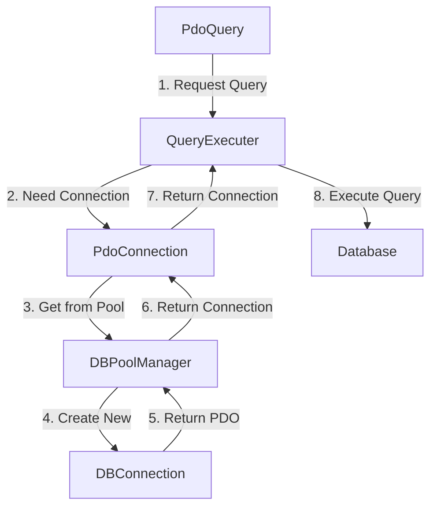
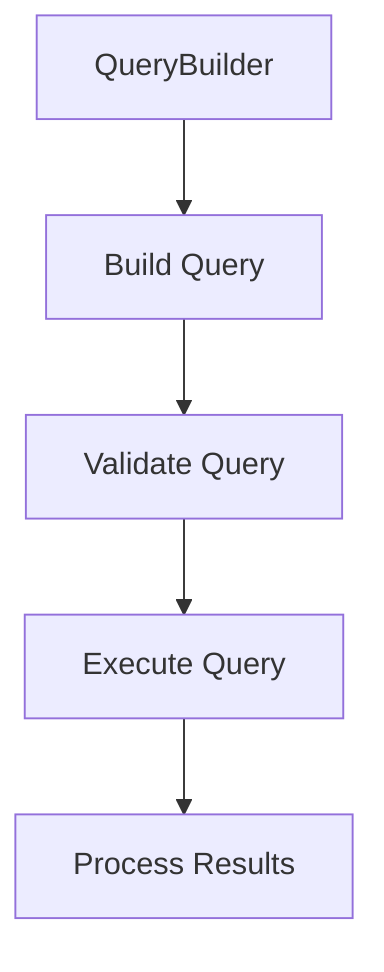
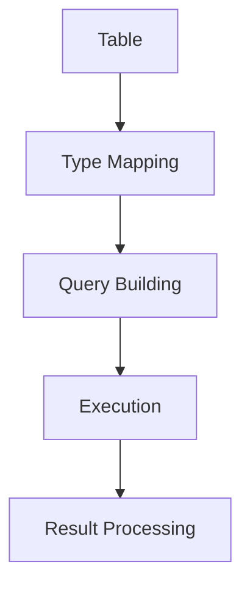

# Database Architecture

## Directory Structure
```
src/database/
├── DBConnection.php      # Base connection class
├── DBPoolManager.php    # Connection pool management
├── PdoConnection.php    # PDO connection wrapper
├── QueryExecuter.php    # Query execution base
├── PdoQuery.php         # High-level query interface
├── query/               # Query building components
├── QueryBuilder.php     # Query builder implementation
├── QueryBuilderInterface.php # Query builder contract
├── Table.php           # Table abstraction
├── TableGenerator.php  # Table generation utilities
└── SqlEnumCondition.php # SQL condition enums
```

## Core Components

### 1. Connection Management
#### DBConnection
- Base connection class
- Creates individual PDO connections
- Handles connection parameters
- No pooling logic
```php
class DBConnection {
    private bool $isConnected;
    private ?string $error;
    private ?PDO $db;
    private string $instanceId;
}
```

#### DBPoolManager
- Manages connection pool
- Uses DBConnection to create new connections
- Tracks available and in-use connections
- Handles connection reuse
```php
class DBPoolManager {
    private static array $availableConnections;
    private static array $inuseConnections;
}
```

#### PdoConnection
- Manages connection lifecycle
- Gets connections from DBPoolManager
- Validates connection health
- Returns connections to pool
```php
class PdoConnection {
    private static array $connectionPool;
    private static int $totalConnections;
    private string $poolKey;
    private string $instanceId;
}
```

### 2. Query Execution
#### QueryExecuter
- Receives connection from PdoConnection
- Handles actual query execution
- Manages prepared statements
- Handles query results
```php
class QueryExecuter {
    private ?PdoConnection $pdoManager;
    private ?PDO $db;
    private bool $isConnected;
}
```

#### PdoQuery
- Entry point for all database operations
- Gets connection from PdoConnection
- Passes connection to QueryExecuter
- Provides high-level query methods
```php
class PdoQuery extends QueryExecuter {
    public function insertQuery()
    public function updateQuery()
    public function deleteQuery()
    public function selectQuery()
    public function selectQueryObjects()
    public function selectCountQuery()
}
```

### 3. Query Building
#### QueryBuilder
- Fluent interface for query construction
- Implements QueryBuilderInterface
- Supports complex query building
```php
class QueryBuilder implements QueryBuilderInterface {
    public function select()
    public function insert()
    public function update()
    public function delete()
    public function where()
    public function orderBy()
    public function limit()
}
```

### 4. Table Management
#### Table
- Table abstraction layer
- Property type mapping
- CRUD operations
```php
class Table {
    protected array $_type_map = [];
    public function select()
    public function insert()
    public function update()
    public function delete()
}
```

#### TableGenerator
- Table structure generation
- Migration support
- Schema management
```php
class TableGenerator {
    public function generate()
    public function migrate()
    public function validate()
}
```

## System Flow

### 1. Connection Flow


### 2. Query Building Flow


### 3. Table Management Flow


## Component Relationships

### 1. PdoQuery → QueryExecuter
- Inheritance relationship
- PdoQuery adds high-level query methods
- QueryExecuter handles actual execution
- Manages connection lifecycle

### 2. QueryExecuter → PdoConnection
- Composition relationship
- QueryExecuter uses PdoConnection to get connections
- Manages connection state
- Handles connection errors

### 3. PdoConnection → DBPoolManager
- Uses DBPoolManager to manage connection pool
- Handles connection validation
- Returns connections to pool
- Manages connection health

### 4. DBPoolManager → DBConnection
- Uses DBConnection to create new connections
- Manages connection lifecycle
- Tracks connection state
- Handles connection reuse

## Configuration

### Environment Variables
```env
# Database Configuration
DB_HOST_CLI_DEV="localhost"
DB_HOST="db"
DB_PORT=your_port
DB_NAME=your_database
DB_USER=your_username
DB_PASSWORD=your_password
DB_CHARSET=utf8mb4

# Connection Pool Settings
MIN_DB_CONNECTION_POOL=2
MAX_DB_CONNECTION_POOL=10
DB_CONNECTION_MAX_AGE=3600
DB_CONNECTION_TIME_OUT=20
DB_CONNECTION_EXPIER_TIME=20
DB_QUERY_TIMEOUT=30

# Query Cache Settings
DB_CACHE_ENABLED=true
DB_CACHE_TTL_SEC=3600
DB_CACHE_MAX_QUERY_SIZE=1000

APP_ENV=dev  # or 'prod'
```

## Usage Examples

### 1. Table Operations
```php
class UserTable extends Table {
    public int $id;
    public string $username;
    public string $email;
    
    protected array $_type_map = [
        'id' => 'int',
        'is_active' => 'bool'
    ];
}

$userTable = new UserTable();

// Select
$users = $userTable->select()
    ->where('is_active', true)
    ->orderBy('created_at', 'DESC')
    ->run();

// Insert
$userId = $userTable->insert([
    'username' => 'john_doe',
    'email' => 'john@example.com'
])->run();
```

### 2. Raw Query Operations
```php
$pdoQuery = new PdoQuery();

// Transaction
try {
    $pdoQuery->beginTransaction();
    
    $pdoQuery->insertQuery(
        "INSERT INTO users (name, email) VALUES (:name, :email)",
        [':name' => 'John', ':email' => 'john@example.com']
    );
    
    $pdoQuery->commit();
} catch (Exception $e) {
    $pdoQuery->rollback();
    throw $e;
}
```

## Best Practices

### 1. Connection Management
- Use connection pooling
- Release connections properly
- Handle connection errors
- Monitor connection health

### 2. Query Building
- Use fluent interface
- Chain methods for readability
- Validate query parameters
- Monitor query performance

### 3. Table Management
- Define property types
- Use type mapping
- Implement validation
- Handle relationships

### 4. Error Handling
- Catch and log errors
- Clean up resources
- Provide meaningful messages
- Handle failures gracefully

## System Limitations

1. **Connection Management**
   - Static state in pool manager
   - Potential thread safety issues
   - Memory management concerns

2. **Configuration**
   - Direct environment variable dependency
   - Limited configuration validation
   - No default configuration handling

## Future Improvements

1. **Architecture**
   - Simplify connection management
   - Implement dependency injection
   - Add configuration management
   - Improve testing support

2. **Features**
   - Add connection retry logic
   - Implement query logging
   - Add performance monitoring
   - Enhance error handling

3. **Security**
   - Add connection encryption
   - Implement access control
   - Add query validation
   - Enhance error reporting

## Next Steps

- [Request Lifecycle](request-lifecycle.md)
- [Security Guide](../guides/security.md)
- [Performance Guide](../guides/performance.md)
